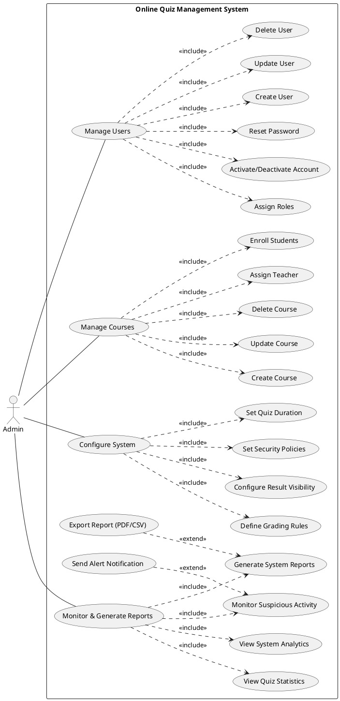

# Complete Admin Use Case Diagram

```plantuml
@startuml
left to right direction
skinparam packageStyle rectangle

actor Admin

rectangle "Online Quiz Management System" {

    usecase "Manage Users" as UC_ManageUsers
    usecase "Manage Courses" as UC_ManageCourses
    usecase "Configure System" as UC_ConfigureSystem
    usecase "Monitor & Generate Reports" as UC_MonitorReports

    usecase "Create User" as UC_CreateUser
    usecase "Update User" as UC_UpdateUser
    usecase "Delete User" as UC_DeleteUser
    usecase "Assign Roles" as UC_AssignRoles
    usecase "Activate/Deactivate Account" as UC_ActivateDeactivate
    usecase "Reset Password" as UC_ResetPassword

    usecase "Create Course" as UC_CreateCourse
    usecase "Update Course" as UC_UpdateCourse
    usecase "Delete Course" as UC_DeleteCourse
    usecase "Assign Teacher" as UC_AssignTeacher
    usecase "Enroll Students" as UC_EnrollStudents

    usecase "Set Quiz Duration" as UC_SetQuizDuration
    usecase "Define Grading Rules" as UC_DefineGradingRules
    usecase "Configure Result Visibility" as UC_ResultVisibility
    usecase "Set Security Policies" as UC_SetSecurityPolicies

    usecase "View System Analytics" as UC_ViewSystemAnalytics
    usecase "View Quiz Statistics" as UC_ViewQuizStats
    usecase "Monitor Suspicious Activity" as UC_MonitorSuspicious
    usecase "Generate System Reports" as UC_GenerateReports

    usecase "Export Report (PDF/CSV)" as UC_ExportReport
    usecase "Send Alert Notification" as UC_SendAlert
}

' Admin associations to top-level use cases
Admin -- UC_ManageUsers
Admin -- UC_ManageCourses
Admin -- UC_ConfigureSystem
Admin -- UC_MonitorReports

' Manage Users includes
UC_ManageUsers ..> UC_CreateUser : <<include>>
UC_ManageUsers ..> UC_UpdateUser : <<include>>
UC_ManageUsers ..> UC_DeleteUser : <<include>>
UC_ManageUsers ..> UC_AssignRoles : <<include>>
UC_ManageUsers ..> UC_ActivateDeactivate : <<include>>
UC_ManageUsers ..> UC_ResetPassword : <<include>>

' Manage Courses includes
UC_ManageCourses ..> UC_CreateCourse : <<include>>
UC_ManageCourses ..> UC_UpdateCourse : <<include>>
UC_ManageCourses ..> UC_DeleteCourse : <<include>>
UC_ManageCourses ..> UC_AssignTeacher : <<include>>
UC_ManageCourses ..> UC_EnrollStudents : <<include>>

' Configure System includes
UC_ConfigureSystem ..> UC_SetQuizDuration : <<include>>
UC_ConfigureSystem ..> UC_DefineGradingRules : <<include>>
UC_ConfigureSystem ..> UC_ResultVisibility : <<include>>
UC_ConfigureSystem ..> UC_SetSecurityPolicies : <<include>>

' Monitor & Generate Reports includes
UC_MonitorReports ..> UC_ViewSystemAnalytics : <<include>>
UC_MonitorReports ..> UC_ViewQuizStats : <<include>>
UC_MonitorReports ..> UC_MonitorSuspicious : <<include>>
UC_MonitorReports ..> UC_GenerateReports : <<include>>

' Optional extensions
UC_ExportReport ..> UC_GenerateReports : <<extend>>
UC_SendAlert ..> UC_MonitorSuspicious : <<extend>>

@enduml
```

### Notation check
- `<<include>>`: base use case points to mandatory included use case.
- `<<extend>>`: optional use case points to the base use case it extends.