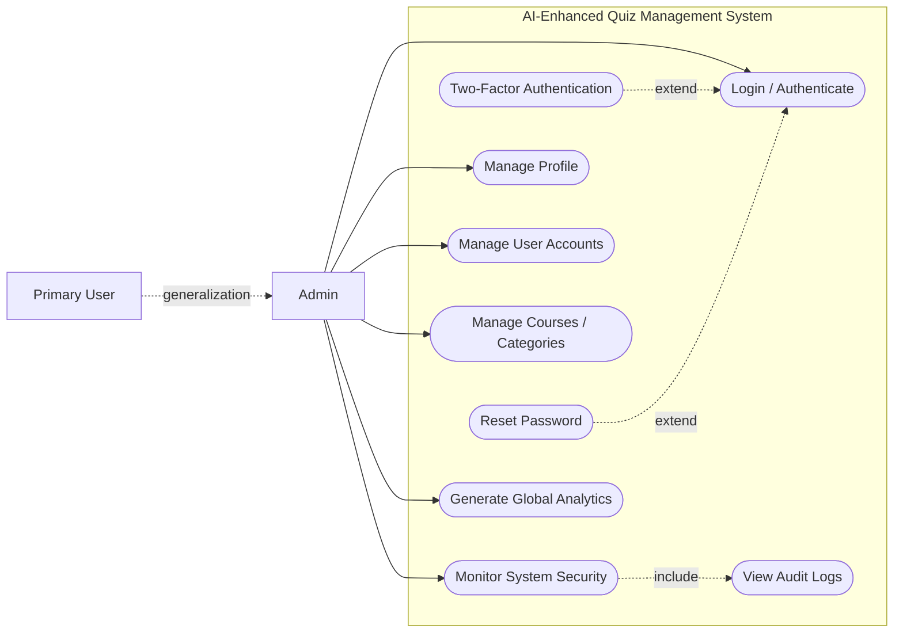

# Admin Use Case Diagram (Markdown Preview)

## AI-Enhanced Quiz Management System

### Legend
- `include`: Mandatory sub-use-case.
- `extend`: Optional/conditional behavior.
- `generalization`: Admin inherits common behavior from Primary User.