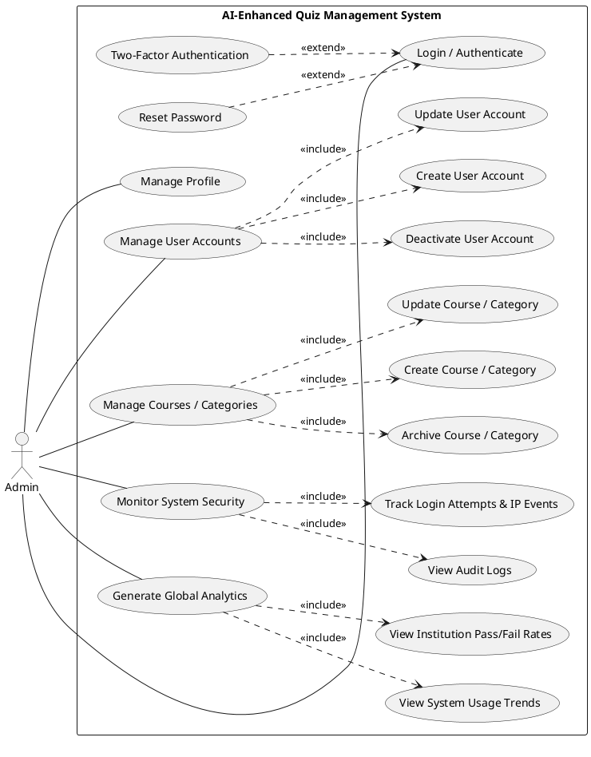

# Admin Use Case Diagram (UML Style)

This version is in the same formal style as your sample: one actor, system boundary, use-case ovals, and correct `<<include>>` / `<<extend>>` relations.

## Quick reading guide

- `Admin -- Use Case`: Admin participates in that functionality.
- `<<include>>`: mandatory sub-function inside the parent use case.
- `<<extend>>`: optional/conditional behavior added to a base use case.

## Why this is complete for Admin scope

- Covers all common Admin-access functions (login/profile).
- Covers governance tasks (users, courses/categories).
- Covers security oversight (audit logs and event tracking).
- Covers institutional reporting (global analytics, trends, pass/fail).