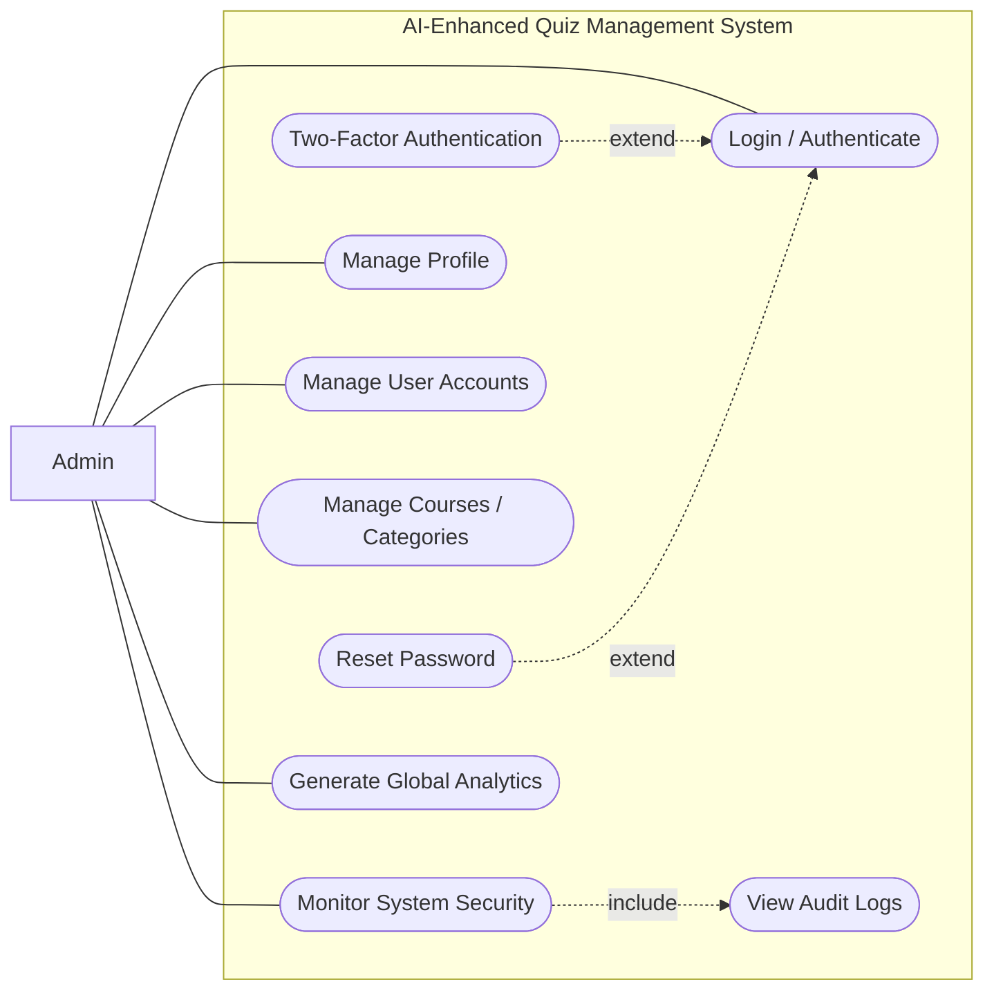

# Admin Use Case Diagram

## AI-Enhanced Quiz Management System (Admin Scope)

## What each Admin use case means

- **Login / Authenticate**: Admin signs in to access protected functions.
- **Two-Factor Authentication (extend Login)**: Optional extra verification when security policy requires it.
- **Reset Password (extend Login)**: Optional recovery path when login fails due to forgotten password.
- **Manage Profile**: Update admin details such as name, email, and profile preferences.
- **Manage User Accounts**: Create, update, deactivate Teacher and Student accounts.
- **Manage Courses / Categories**: Organize subjects, departments, and quiz categories.
- **Monitor System Security**: Observe suspicious activity and enforce security controls.
- **View Audit Logs (included by Monitor Security)**: Mandatory part of security monitoring to inspect login attempts and IP events.
- **Generate Global Analytics**: View institution-wide usage and pass/fail trends.

## Line meaning (important)

- **Admin to use case line (`---`)**: Association only; it shows participation, not sequence.
- **`include` dashed arrow**: Mandatory reused behavior.
- **`extend` dashed arrow**: Optional or conditional behavior.